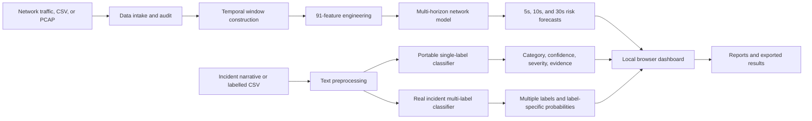

# AI Based Cybercrime Prediction System


A portable, local-first cybersecurity analytics system that combines:

- near-term network attack forecasting;
- single-label incident-text classification;
- multi-label incident intelligence;
- live monitoring and offline traffic analysis;
- CSV and PCAP intake;
- model evaluation, validation, and reporting.

The application runs through a lightweight Python standard-library server and opens a browser-based dashboard. No cloud service, external API, database server, or Python package installation is required for the bundled portable runtime.

> [!IMPORTANT]
> This repository is a research and demonstration system. The network model and fallback text model include synthetic training evidence. The incident multi-label model has an internal chronological evaluation, but it has not been independently externally validated. Predictions must not be treated as proof of an attack or used as the sole basis for consequential action.

---

## Table of contents

- [Key capabilities](#key-capabilities)
- [System architecture](#system-architecture)
- [Model inventory](#model-inventory)
- [Internal evaluation summary](#internal-evaluation-summary)
- [Dashboard modules](#dashboard-modules)
- [Requirements](#requirements)
- [Quick start](#quick-start)
- [Manual startup](#manual-startup)
- [Input data requirements](#input-data-requirements)
- [NLP Evaluation Lab](#nlp-evaluation-lab)
- [Real-data text training](#real-data-text-training)
- [Output and reports](#output-and-reports)
- [Project structure](#project-structure)
- [API overview](#api-overview)
- [Scientific limitations](#scientific-limitations)
- [Responsible use](#responsible-use)
- [Troubleshooting](#troubleshooting)
- [Roadmap](#roadmap)
- [License](#license)

---

## Key capabilities

### Network pre-attack forecasting

- Engineers **91 temporal traffic features**.
- Produces independent forecasts for **5-, 10-, and 30-second horizons**.
- Estimates attack probability, risk, warning priority, likely attack type, and precursor evidence.
- Supports live dashboard monitoring and offline replay.
- Accepts prepared CSV data and PCAP uploads for auditing and processing.
- Covers several network attack families, including denial-of-service, scanning, credential attacks, bot activity, infiltration, and web attacks.

### Incident-text intelligence

- Classifies individual incident narratives.
- Supports batch CSV prediction.
- Provides category, confidence, severity, textual evidence, and recommended analyst action.
- Includes a portable single-label fallback classifier.
- Includes a multi-label classifier that may assign several related incident categories to one narrative.
- Supports low-confidence review states instead of forcing every prediction.

### Evaluation and validation

- Evaluates labelled CSV files locally.
- Supports blind-test CSV files with a separate answer key.
- Calculates multiclass, binary, and calibration-oriented metrics.
- Preserves prediction exports for audit.
- Verifies model files and feature schemas before startup.
- Provides focused model cards, metrics, methodology, architecture, and data-requirement reports.

---

## System architecture



### Runtime design

```text
Browser Interface
        │
        ▼
Local Python HTTP Server
        │
        ├── Network forecasting engine
        ├── Text classification engine
        ├── Multi-label incident engine
        ├── Evaluation engine
        ├── Upload and audit services
        └── Report service
```

The server binds only to a local loopback address such as:

```text
http://127.0.0.1:8765/
```

When that port is unavailable, the application automatically selects another free local port.

---

## Model inventory

| Component | Task | Method | Status |
|---|---|---|---|
| Network forecasting model | Predict near-term network attack onset and attack family | Ensemble temporal classifiers using 91 engineered features | Demonstration model trained with synthetic evidence |
| Portable text fallback | Single-label incident classification and benign/threat triage | Multinomial Naive Bayes with word unigrams and bigrams | Synthetic workflow-testing fallback |
| Incident multi-label model | Assign one or more incident categories to a narrative | TF-IDF word and character features with one-vs-rest linear classification and label-specific thresholds | Trained on verified incident narratives; internally evaluated chronologically |

### Multi-label incident categories

**Primary categories**

- Phishing
- Ransomware
- Malware
- Account takeover
- Web exploitation
- Social engineering
- Privilege misuse
- Data breach

**Limited-evidence categories**

- Botnet or command-and-control activity
- Denial-of-service activity
- Brute-force activity
- Port scanning
- SQL injection
- Cross-site scripting

Limited-evidence categories should be interpreted conservatively because their validation and test coverage is smaller.

---

## Internal evaluation summary

The incident multi-label classifier was evaluated on a later chronological partition that was not used for fitting or threshold selection.

| Metric | Internal chronological result |
|---|---:|
| Training narratives | 4,624 |
| Validation narratives | 1,073 |
| Test narratives | 1,186 |
| Primary-label micro-F1 | 0.7650 |
| Primary-label macro-F1 | 0.6186 |

These values represent an **internal chronological holdout**, not independent external validation. They may not transfer to a different organisation, reporting style, sector, language, time period, or incident taxonomy.

The bundled network and fallback text metrics must be treated as demonstration results because their evidence is synthetic.

---

## Dashboard modules

### Overview

Provides a high-level operational summary, model status, current risks, recent predictions, and system health.

### Live Monitoring

Displays temporal network signals and repeatedly updates near-term predictions for the supported forecast horizons.

### Threat Intelligence

Summarises detected or forecast attack classes, evidence, risk level, and suggested defensive actions.

### Text Intelligence

Supports:

- single incident-text prediction;
- batch CSV prediction;
- multi-label incident analysis;
- labelled-data evaluation;
- blind evaluation with a separate answer key;
- verified-data training and model activation.

### Data Workspace

Supports CSV and PCAP intake, schema inspection, file audit, and preprocessing-oriented diagnostics.

### Model Lab

Displays model readiness, feature and class information, evaluation status, validation evidence, and model integrity.

### Reports

Provides only focused, source-neutral technical reports:

- Network Pre-Attack Performance
- Network Model Card
- Real Incident Classifier Performance
- Real Incident Model Card
- System Architecture
- Model Methodology
- Data Requirements

---

## Requirements

### Supported runtime

- **64-bit Python 3.10 or newer**
- Windows 10 or Windows 11
- Native x64 or ARM64 Python
- A modern web browser

The portable runtime uses Python's standard library and the bundled model files. It does not require `pip install`.

### Recommended resources

- 4 GB RAM or more
- 500 MB free disk space
- A Chromium-based browser, Firefox, or another modern browser

---

## Quick start

1. Download or clone the repository.
2. Extract the complete project if it was downloaded as a ZIP.
3. Keep the original directory structure intact.
4. Double-click:

```text
START.bat
```

5. Wait for model verification to finish.
6. The dashboard should open automatically in the default browser.
7. Keep the command window open while the application is running.
8. Press `Ctrl+C` in the command window to stop the server.

> [!WARNING]
> Do not run `START.bat` from inside a compressed ZIP preview. Extract the full project first.

---

## Manual startup

The Windows launcher is recommended, but the server can also be started manually.

### Verify the model bundle

```bash
python verify_system.py
```

### Start the local application

```bash
python portable_server.py
```

The terminal displays the selected local URL.

---

## Input data requirements

## Network forecasting data

The model expects the exact **91-feature temporal schema** defined in:

```text
models/cybercrime_feature_schema.json
```

Important network inputs include:

- timestamps;
- flow rate;
- source and destination diversity;
- source and destination concentration;
- port diversity and entropy;
- protocol entropy;
- packets and bytes per second;
- SYN, ACK, and RST statistics;
- packet-length statistics;
- flow-duration statistics;
- forward and backward packet counts;
- traffic ratios and burstiness.

For scientifically valid retraining or evaluation, network data should also contain verified attack labels or an independently documented attack schedule.

### Network data rules

- Observation windows must not contain future information.
- Attack-onset targets must be aligned to timestamps.
- Overlapping windows must not leak across partitions.
- Train, validation, and test periods should be chronological.
- Captures from the same event or campaign should remain in one partition.
- Raw PCAP files are unlabelled unless aligned to verified ground truth.

## Incident-text prediction data

A prediction file needs one recognised narrative column, such as:

```text
incident_text
description
incident_description
report_text
text
message
narrative
```

Real-data training also recognises:

```text
summary
details
```

### Example prediction CSV

```csv
record_id,incident_text
INC-001,"A user received an urgent password-reset message linking to an unfamiliar sign-in page."
INC-002,"A public service received a sudden distributed traffic surge and became unavailable."
```

### Recommended provenance fields

- `record_id`
- `incident_date`
- `source`
- `campaign_id`
- `synthetic`
- `split`

Provenance fields should be retained for audit but must not be used as predictive text features.

---

## NLP Evaluation Lab

The evaluation engine supports two workflows.

### Option 1: Direct labelled evaluation

Upload one CSV containing both the narrative and target label.

Recognised multiclass label columns include:

```text
attack_type
label
class
target
category
incident_type
```

Recognised binary label columns include:

```text
binary_label
is_malicious
malicious
threat_label
```

Example:

```csv
record_id,incident_text,attack_type,binary_label
CASE-001,"A cloned login page captured the user's credentials.",PHISHING,MALICIOUS
CASE-002,"A routine approved backup completed successfully.",BENIGN,BENIGN
```

### Option 2: Blind test with a separate answer key

The test CSV contains the narrative and a shared identifier:

```csv
record_id,incident_text
CASE-001,"A cloned login page captured the user's credentials."
```

The answer key contains the same identifier and the expected label:

```csv
record_id,attack_type
CASE-001,PHISHING
```

Recognised shared identifier columns include:

```text
record_id
id
incident_id
case_id
```

### Important multi-label note

The standard NLP Evaluation Lab expects one fine-grained class per row. A pipe-separated multi-label target such as:

```text
PHISHING|ACCOUNT_TAKEOVER
```

should be evaluated through the dedicated multi-label incident evaluation workflow rather than being forced into one class.

---

## Real-data text training

The training workflow accepts:

- CSV
- JSON
- JSONL
- NDJSON
- compressed JSON
- ZIP archives containing supported records

A verified training file requires:

- a recognised incident-text field;
- a recognised attack-label field;
- at least 200 usable real records;
- at least two classes;
- sufficient records in each final partition.

Records explicitly marked as synthetic are rejected from real-data training.

### Split priority

The training pipeline uses the strongest available separation method:

1. user-provided train, validation, and test partitions;
2. chronological partitioning;
3. group-aware partitioning;
4. deterministic stratified fallback.

### Validation status

The application distinguishes between:

- synthetic demonstration;
- real-data internal evaluation;
- independently externally validated.

A model is not marked as externally validated unless a separate labelled external dataset is supplied and overlap checks pass.

---

## Output and reports

Runtime output directories are created automatically:

```text
outputs/
├── logs/
├── predictions/
├── text_predictions/
├── text_evaluations/
├── real_incident_evaluations/
└── realworld_training/
```

Typical outputs include:

- network prediction CSV files;
- text prediction exports;
- evaluation summaries;
- row-level prediction comparisons;
- training-job records;
- startup integrity logs;
- model metrics and model cards.

---

## Project structure

```text
AI_Based_Cybercrime_Prediction_System/
├── START.bat
├── portable_server.py
├── verify_system.py
├── nlp_classifier.py
├── nlp_evaluation.py
├── incident_multilabel.py
├── realworld_nlp.py
├── MODEL_MANIFEST.json
│
├── web/
│   └── index.html
│
├── models/
│   ├── portable_prediction_model.pkl.gz
│   ├── cybercrime_feature_schema.json
│   ├── cybercrime_prediction_metrics.json
│   ├── model_card.json
│   ├── portable_text_classifier.json.gz
│   ├── text_classifier_metrics.json
│   ├── text_model_card.json
│   ├── real_incident_multilabel_classifier.json.gz
│   ├── real_incident_multilabel_metrics.json
│   └── real_incident_multilabel_model_card.json
│
├── data/
│   ├── processed/
│   │   └── universal_pre_attack_windows.csv
│   ├── uploads/
│   └── real/
│       └── raw/
│
├── docs/
│   ├── ARCHITECTURE.md
│   ├── DATA_REQUIREMENTS.md
│   ├── LIVE_MONITOR_GUIDE.md
│   ├── METHODOLOGY.md
│   └── REAL_INCIDENT_MODEL_GUIDE.md
│
└── outputs/
    ├── logs/
    ├── predictions/
    ├── text_predictions/
    ├── text_evaluations/
    ├── real_incident_evaluations/
    └── realworld_training/
```

Some runtime directories are created only after the first launch.

---

## API overview

The browser interface communicates with a local JSON API.

### General

| Endpoint | Purpose |
|---|---|
| `GET /api/health` | Runtime and bundle health |
| `GET /api/overview` | Dashboard summary |
| `GET /api/model` | Network model information |
| `GET /api/reports` | Available reports |
| `GET /api/live` | Live monitoring state |
| `GET /api/threats` | Current threat information |

### Text intelligence

| Endpoint | Purpose |
|---|---|
| `POST /api/nlp/predict` | Single-text prediction |
| `POST /api/nlp/batch` | Batch text prediction |
| `POST /api/nlp/evaluate` | Standard labelled evaluation |
| `GET /api/nlp/model` | Active text-model information |
| `POST /api/nlp/real-incident/predict` | Multi-label incident prediction |
| `POST /api/nlp/real-incident/evaluate` | Multi-label incident evaluation |
| `GET /api/nlp/real-incident/status` | Multi-label model status |

### Verified-data training

| Endpoint | Purpose |
|---|---|
| `POST /api/nlp/realworld/train` | Start a training job |
| `GET /api/nlp/realworld/job` | Read training-job progress |
| `GET /api/nlp/realworld/status` | Read model and training status |
| `POST /api/nlp/realworld/activate` | Switch the active text model |

### Data intake

| Endpoint | Purpose |
|---|---|
| `POST /api/upload` | Standard file upload |
| `POST /api/upload/init` | Initialise chunked upload |
| `POST /api/upload/chunk` | Upload a file chunk |
| `POST /api/upload/finalize` | Finalise chunked upload |
| `GET /api/upload/status` | Read upload status |

The API is intended for the bundled local interface. It does not include authentication and should not be exposed directly to an untrusted network.

---

## Scientific limitations

1. **Synthetic network evidence**  
   The bundled network forecasting model is a demonstration model. Its metrics are not proof of production performance.

2. **Synthetic fallback text evidence**  
   The portable single-label fallback classifier was trained on synthetic English incident descriptions.

3. **No independent external validation**  
   The incident multi-label classifier has an internal chronological holdout, not a fully independent external evaluation.

4. **No genuine benign corpus in the incident model**  
   Confirmed incident narratives do not provide a representative set of ordinary benign SOC or helpdesk records.

5. **Rare-category limitations**  
   Some attack categories contain limited examples and should be treated as experimental.

6. **Domain and language shift**  
   Performance may change across organisations, sectors, languages, terminology, time periods, and reporting styles.

7. **No attribution or intent inference**  
   The system predicts patterns and incident categories. It does not establish criminal identity, legal responsibility, human intent, or causation.

8. **Human review remains necessary**  
   Consequential containment, disciplinary, legal, or reporting decisions require qualified analyst review and corroborating evidence.

---

## Responsible use

Use this system for:

- cybersecurity research;
- defensive analytics;
- controlled demonstrations;
- dataset auditing;
- educational experimentation;
- model evaluation;
- analyst decision support.

Do not use model output as the sole basis for:

- accusing or identifying an individual;
- legal conclusions;
- employee disciplinary action;
- automated account termination;
- destructive containment;
- public attribution;
- emergency reporting without verification.

Protect uploaded incident data and network captures. Remove credentials, personal information, secrets, and regulated data before sharing a repository publicly.

---

## Troubleshooting

### The launcher says the application is incomplete

Extract the entire repository or release ZIP. Confirm that these files exist:

```text
portable_server.py
web/index.html
models/portable_prediction_model.pkl.gz
models/portable_text_classifier.json.gz
models/real_incident_multilabel_classifier.json.gz
```

### Python is not detected

Install a 64-bit Python version from 3.10 onward. Native Windows ARM64 Python is supported.

Check the installation:

```bash
python --version
python -c "import struct; print(struct.calcsize('P') * 8)"
```

The second command should print:

```text
64
```

### Model verification fails

Run:

```bash
python verify_system.py
```

Review:

```text
outputs/logs/startup_verification.json
```

Do not rename, edit, or partially copy the bundled model files.

### The browser does not open

Read the local URL printed in the command window and open it manually. It normally resembles:

```text
http://127.0.0.1:8765/
```

### NLP evaluation says that a label column is missing

Use one of the recognised label fields:

```text
attack_type
label
class
target
category
incident_type
```

For a separate answer key, both files must contain a shared identifier such as `record_id`.

### A multi-label CSV fails in the standard Evaluation Lab

Use the dedicated multi-label incident evaluation workflow, or prepare a single-label evaluation subset. Do not arbitrarily collapse multiple correct labels into one class.

---

## Roadmap

- Independent external evaluation on separately sourced incident narratives
- Collection of authorised genuine benign operational text
- Real timestamped network datasets with verified attack-onset schedules
- Purged chronological and site-separated network validation
- Expanded rare-category evidence
- Model calibration and abstention analysis across domains
- Explainability improvements for temporal network warnings
- Authentication and access control for multi-user deployments
- Linux and macOS launch scripts
- Automated tests and continuous integration

---

## License

No open-source license is included in the current model package. Before publishing or redistributing the repository, add a suitable `LICENSE` file and verify that all included datasets, trained artefacts, and third-party materials may be distributed under that licence.

---

## Citation

For academic or project reporting, cite the repository using a format similar to:

```bibtex
@software{ai_based_cybercrime_prediction_system,
  title  = {AI Based Cybercrime Prediction System},
  author = {Project Contributors},
  year   = {2026},
  note   = {Local multi-model cybersecurity analytics research prototype}
}
```

Replace `Project Contributors` with the final author or team names before publication.
